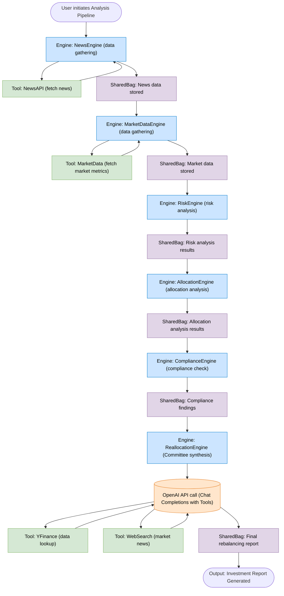
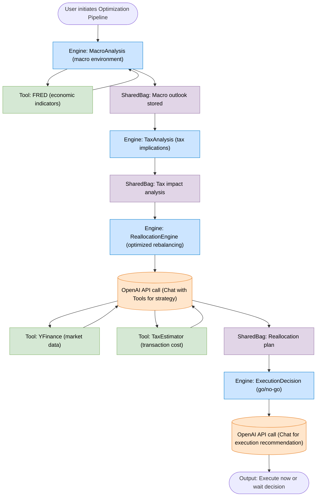
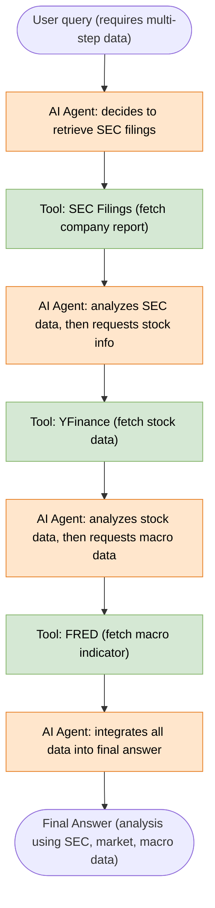
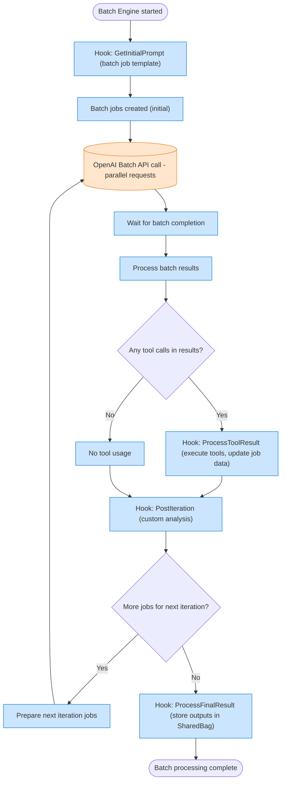
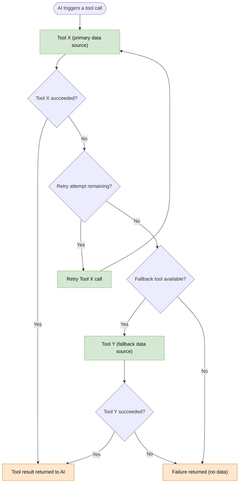
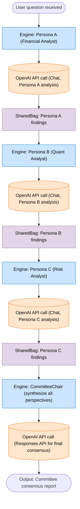
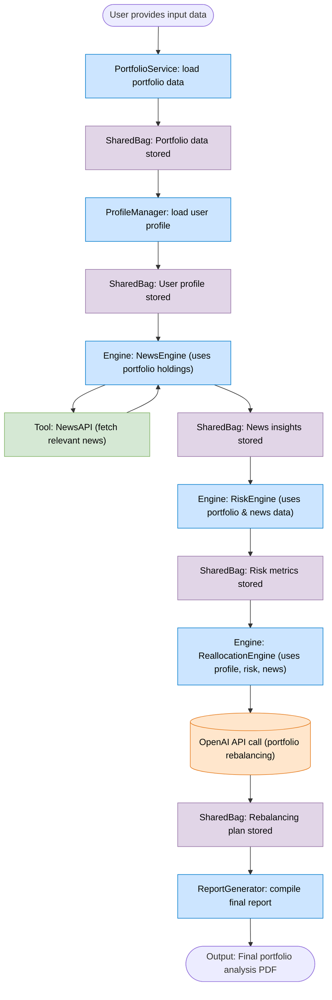

# Mosychlos Execution Flow Diagrams

## Analyze Pipeline: Data → Function → Committee → Report

## Optimize Pipeline: Macro + Tax → Reallocation → Execution Decision

## Tool Chaining with NEXT_PATTERN (SEC → YFinance → FRED)

## Batch Tool Iteration (Multi-item Processing)

## Tool Failure with Fallback Handling

## Persona-Based Multi-Agent Reasoning

## SharedBag Context Propagation Through Engines and Tools

