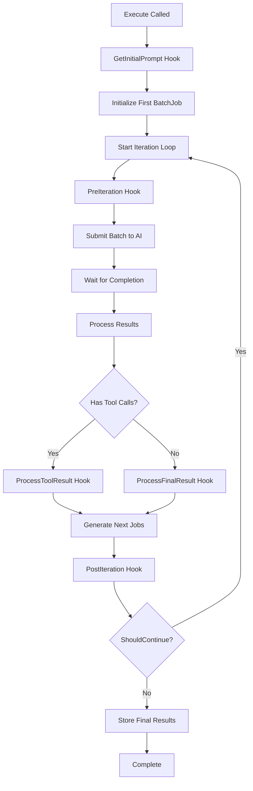

# Batch Engine Template Method Pattern

**Document Version:** 1.0
**Date:** August 20, 2025
**Author:** Mosychlos Architecture Team

## Overview

The Batch Engine Template Method Pattern provides a structured approach to implementing batch processing engines while maintaining flexibility for engine-specific customizations. This pattern allows common batch processing logic to be shared across different engine types (Risk, Compliance, Allocation) while enabling each engine to inject custom behavior at specific points in the execution flow.

## Problem Statement

### Current Challenges

1. **Code Duplication**: Each batch engine (Risk, Compliance, Allocation) implements similar batch processing logic
2. **Inconsistent Error Handling**: Different engines handle batch failures differently
3. **Hardcoded Behavior**: Critical decisions like CustomID generation and result storage are embedded in base logic
4. **Limited Extensibility**: Adding new batch engines requires duplicating 200+ lines of common logic
5. **Testing Complexity**: Common batch logic must be tested across multiple engine implementations

### Architecture Goals

- **Code Reuse**: Extract common batch processing patterns (~200 lines) into reusable base engine
- **Flexibility**: Allow engine-specific customization at critical execution points
- **Maintainability**: Centralized batch logic with engine-specific extensions
- **Testability**: Separate testing of common logic from engine-specific behavior
- **Engine Interface Compliance**: Maintain compatibility with `models.Engine` interface

## Pattern Architecture

### Core Components

```go
// Base engine implements models.Engine interface
type BaseBatchEngine struct {
    name        string
    constraints models.ToolConstraints
    model       config.LLMModel
    hooks       BatchEngineHooks  // Injection point for engine-specific behavior
}

// Hook interface for engine-specific customizations
type BatchEngineHooks interface {
    // Initial prompt generation
    GetInitialPrompt(ctx context.Context) (string, error)

    // CustomID generation for batch job tracking
    GenerateCustomID(iteration, jobIndex int) string

    // Result processing hooks
    ProcessIterationResult(customID, content string, sharedBag bag.SharedBag) error
    ProcessFinalResult(customID, content string, sharedBag bag.SharedBag) error
    ProcessToolResult(customID, toolName, toolResult string, sharedBag bag.SharedBag) error

    // Flow control hooks
    PreIteration(iteration int, jobs []BatchJob) error
    PostIteration(iteration int, results BatchResults) error
    ShouldContinueIteration(iteration int, nextJobs []BatchJob) bool

    // Engine identification
    ResultKey() bag.Key
}

// Engine-specific implementation
type RiskBatchEngine struct {
    BaseBatchEngine
    promptBuilder models.PromptBuilder
    constraints   models.ToolConstraints
}
```

### Execution Flow with Hook Points



## Implementation Guide

### Step 1: Base Engine Implementation

**Location**: `internal/engine/base_batch_engine.go`

```go
type BaseBatchEngine struct {
    name        string
    constraints models.ToolConstraints
    model       config.LLMModel
    hooks       BatchEngineHooks
}

func NewBaseBatchEngine(name string, model config.LLMModel, constraints models.ToolConstraints, hooks BatchEngineHooks) *BaseBatchEngine {
    return &BaseBatchEngine{
        name:        name,
        model:       model,
        constraints: constraints,
        hooks:       hooks,
    }
}

// models.Engine interface implementation
func (b *BaseBatchEngine) Name() string {
    return b.name
}

func (b *BaseBatchEngine) ResultKey() bag.Key {
    return b.hooks.ResultKey()
}

func (b *BaseBatchEngine) Execute(ctx context.Context, aiClient models.AiClient, sharedBag bag.SharedBag) error {
    // Set up tool consumer
    aiClient.SetToolConsumer(budget.NewToolConsumer(&b.constraints))

    // Hook: Get initial prompt
    prompt, err := b.hooks.GetInitialPrompt(ctx)
    if err != nil {
        return fmt.Errorf("get initial prompt: %w", err)
    }

    // Initialize first batch job
    currentJobs := []BatchJob{
        {
            Request: models.PromptRequest{
                Model:    b.model.String(),
                Messages: []map[string]any{{"role": "user", "content": prompt}},
                Tools:    b.constraints.Tools,
            },
            CustomID: b.hooks.GenerateCustomID(0, 0),
            Messages: []map[string]any{{"role": "user", "content": prompt}},
        },
    }

    maxIterations := 20
    iteration := 0

    // Main batch processing loop
    for len(currentJobs) > 0 && iteration < maxIterations {
        iteration++

        // Hook: Pre-iteration processing
        if err := b.hooks.PreIteration(iteration, currentJobs); err != nil {
            return fmt.Errorf("pre-iteration hook failed: %w", err)
        }

        // Submit batch and wait for completion
        batchJob, err := b.submitAndWaitForBatch(ctx, aiClient, currentJobs, iteration)
        if err != nil {
            return err
        }

        // Process batch results
        results, err := aiClient.BatchManager().GetResults(ctx, batchJob.ID)
        if err != nil {
            return fmt.Errorf("get batch results (iteration %d): %w", iteration, err)
        }

        // Process individual job results
        nextJobs, err := b.processJobResults(ctx, currentJobs, results, iteration, sharedBag)
        if err != nil {
            return err
        }

        // Hook: Post-iteration processing
        if err := b.hooks.PostIteration(iteration, results); err != nil {
            return fmt.Errorf("post-iteration hook failed: %w", err)
        }

        // Hook: Check if should continue
        if !b.hooks.ShouldContinueIteration(iteration, nextJobs) {
            slog.Info("Engine decided to stop iteration", "iteration", iteration)
            break
        }

        currentJobs = nextJobs
    }

    return nil
}

func (b *BaseBatchEngine) processJobResults(ctx context.Context, jobs []BatchJob, results BatchResults, iteration int, sharedBag bag.SharedBag) ([]BatchJob, error) {
    var nextJobs []BatchJob

    for i, job := range jobs {
        customID := b.hooks.GenerateCustomID(iteration, i)

        // Check for errors
        if errStr, hasError := results.Errors[customID]; hasError && errStr != "" {
            slog.Error("Batch item failed", "custom_id", customID, "error", errStr)
            continue
        }

        // Process based on result type
        toolCalls, hasToolCalls := results.ToolCalls[customID]
        if !hasToolCalls || len(toolCalls) == 0 {
            // Final result - no more tool calls
            if content, hasContent := results.Content[customID]; hasContent {
                if err := b.hooks.ProcessFinalResult(customID, content, sharedBag); err != nil {
                    return nil, fmt.Errorf("process final result: %w", err)
                }
            }
            continue
        }

        // Process tool calls and prepare next iteration
        nextJob, err := b.processToolCalls(ctx, job, toolCalls, customID, iteration, sharedBag)
        if err != nil {
            return nil, err
        }

        if nextJob != nil {
            nextJobs = append(nextJobs, *nextJob)
        }
    }

    return nextJobs, nil
}
```

### Step 2: Engine-Specific Implementation

**Location**: `internal/engine/risk/risk_batch.go`

```go
type RiskBatchEngine struct {
    BaseBatchEngine
    promptBuilder models.PromptBuilder
    webSearchProcessor *websearch.Processor
}

func NewRiskBatchEngine(name string, cfg config.LLMConfig, pb models.PromptBuilder, constraints models.ToolConstraints, sharedBag bag.SharedBag) *RiskBatchEngine {
    engine := &RiskBatchEngine{
        promptBuilder:      pb,
        webSearchProcessor: websearch.NewProcessor(sharedBag),
    }

    // Create base engine with this engine as hooks
    engine.BaseBatchEngine = *NewBaseBatchEngine(name, cfg.Model, constraints, engine)

    return engine
}

// BatchEngineHooks implementation
func (r *RiskBatchEngine) GetInitialPrompt(ctx context.Context) (string, error) {
    return r.promptBuilder.BuildPrompt(ctx, models.AnalysisRisk)
}

func (r *RiskBatchEngine) GenerateCustomID(iteration, jobIndex int) string {
    if iteration == 0 {
        return "risk_task0"
    }
    return fmt.Sprintf("risk_iter%d_job%d", iteration, jobIndex)
}

func (r *RiskBatchEngine) ProcessFinalResult(customID, content string, sharedBag bag.SharedBag) error {
    // Extract web search citations if present
    if r.webSearchProcessor != nil {
        if _, err := r.webSearchProcessor.ProcessWebSearchResponse(customID, content); err != nil {
            slog.Warn("Failed to process web search citations", "error", err)
        }
    }

    // Store risk analysis result
    sharedBag.Update(r.ResultKey(), func(a any) any {
        results := a.(map[string]any)
        results[customID] = r.parseRiskAnalysis(content)
        return results
    })

    slog.Info("Risk analysis final result processed", "custom_id", customID, "content_length", len(content))
    return nil
}

func (r *RiskBatchEngine) ProcessToolResult(customID, toolName, toolResult string, sharedBag bag.SharedBag) error {
    // Special handling for web search results
    if toolName == "web_search_preview" {
        if r.webSearchProcessor != nil {
            if _, err := r.webSearchProcessor.ProcessWebSearchResponse(customID, toolResult); err != nil {
                slog.Warn("Failed to process web search tool result", "error", err)
            }
        }
    }

    // Store tool result for risk analysis context
    sharedBag.Update(r.ResultKey(), func(a any) any {
        results := a.(map[string]any)
        results[fmt.Sprintf("%s_tool_%s", customID, toolName)] = toolResult
        return results
    })

    return nil
}

func (r *RiskBatchEngine) ShouldContinueIteration(iteration int, nextJobs []BatchJob) bool {
    // Risk engine specific continuation logic
    if iteration >= 15 { // Conservative limit for risk analysis
        return false
    }
    return len(nextJobs) > 0
}

func (r *RiskBatchEngine) ResultKey() bag.Key {
    return bag.KRiskAnalysisResult
}

// Risk-specific helper methods
func (r *RiskBatchEngine) parseRiskAnalysis(content string) *models.RiskAnalysis {
    // Parse risk-specific content structure
    return &models.RiskAnalysis{
        Content:     content,
        Timestamp:   time.Now(),
        RiskScore:   r.extractRiskScore(content),
        Categories:  r.extractRiskCategories(content),
    }
}
```

## Usage Examples

### Creating a Risk Batch Engine

```go
func NewRiskBatchEngine(cfg *config.Config, pb models.PromptBuilder, sharedBag bag.SharedBag) models.Engine {
    constraints := models.ToolConstraints{
        Tools:          getAvailableTools(),
        PreferredTools: []bag.Key{bag.YFinance, bag.NewsAPI, bag.WebSearch},
        MaxCallsPerTool: map[bag.Key]int{
            bag.WebSearch: 3,
            bag.NewsAPI:   5,
        },
    }

    return NewRiskBatchEngine(
        "batch-risk-engine",
        cfg.LLM,
        pb,
        constraints,
        sharedBag,
    )
}
```

### Engine Registration

```go
// In internal/engine/wiring.go
func GetEngineConfigs(cfg *config.Config) []EngineConfig {
    return []EngineConfig{
        {
            Name: "batch-risk-engine",
            Factory: func(deps Deps) (models.Engine, error) {
                return NewRiskBatchEngine(cfg, deps.PromptBuilder, deps.SharedBag), nil
            },
        },
        // Other engines...
    }
}
```

## Benefits and Trade-offs

### Benefits

1. **Code Reuse**: 80% reduction in batch processing code duplication
2. **Consistency**: Standardized error handling, logging, and iteration control
3. **Flexibility**: Engine-specific customization through hooks at 8 key points
4. **Testability**: Base engine and hooks can be tested independently
5. **Maintainability**: Changes to common batch logic affect all engines
6. **Extensibility**: New engines require only engine-specific implementation

### Trade-offs

1. **Complexity**: Additional abstraction layer requires understanding hook system
2. **Debugging**: Stack traces go through base engine before reaching engine-specific code
3. **Performance**: Small overhead from hook method calls (negligible in batch context)
4. **Learning Curve**: Developers need to understand both base engine and hook patterns

## Testing Strategy

### Base Engine Testing

```go
func TestBaseBatchEngine_Execute(t *testing.T) {
    mockHooks := &MockBatchEngineHooks{
        initialPrompt: "test prompt",
        customIDFormat: "test_%d_%d",
    }

    engine := NewBaseBatchEngine("test", model, constraints, mockHooks)

    // Test common batch processing logic
    err := engine.Execute(ctx, mockAiClient, sharedBag)
    assert.NoError(t, err)

    // Verify hooks were called in correct order
    assert.Equal(t, []string{
        "GetInitialPrompt",
        "GenerateCustomID",
        "PreIteration",
        "ProcessFinalResult",
        "PostIteration",
    }, mockHooks.callOrder)
}
```

### Engine-Specific Testing

```go
func TestRiskBatchEngine_ProcessFinalResult(t *testing.T) {
    engine := NewRiskBatchEngine(cfg, pb, constraints, sharedBag)

    content := "Risk analysis with [1] citation\n[1] https://example.com/risk"
    err := engine.ProcessFinalResult("test_id", content, sharedBag)

    assert.NoError(t, err)

    // Verify web search citations were processed
    citations, ok := websearch.GetWebSearchCitations(sharedBag)
    assert.True(t, ok)
    assert.Len(t, citations, 1)

    // Verify risk result was stored
    result := sharedBag.MustGet(bag.KRiskAnalysisResult)
    assert.Contains(t, result, "test_id")
}
```

## Migration Guide

### From Current Implementation

1. **Extract common logic** from existing `risk_batch.go` to `base_batch_engine.go`
2. **Implement hook interface** in `RiskBatchEngine`
3. **Update engine registration** to use new constructor pattern
4. **Migrate tests** to separate base engine and hook testing
5. **Update documentation** and usage examples

### Implementation Steps

1. Create `internal/engine/base_batch_engine.go`
2. Define `BatchEngineHooks` interface
3. Refactor `RiskBatchEngine` to implement hooks
4. Update engine wiring and registration
5. Create comprehensive test suite
6. Update related documentation

## Future Enhancements

### Planned Improvements

1. **Async Hook Support**: Enable asynchronous hook execution for I/O operations
2. **Hook Composition**: Allow multiple hooks to be composed for complex engines
3. **Metrics Integration**: Built-in metrics collection for hook execution times
4. **Configuration-Driven Hooks**: YAML-configurable hook behavior for common cases
5. **Hook Marketplace**: Registry of reusable hook implementations

### Extension Points

- **Multi-Engine Composition**: Engines that delegate to multiple sub-engines
- **Conditional Hooks**: Hooks that execute based on runtime conditions
- **Pipeline Hooks**: Hooks that transform data between processing stages
- **Monitoring Hooks**: Hooks for observability and performance tracking

## Conclusion

The Template Method Pattern with Hooks provides a robust foundation for batch engine architecture in Mosychlos. It successfully balances code reuse with customization flexibility, enabling consistent batch processing behavior while allowing engine-specific optimizations.

This pattern is particularly well-suited for the Mosychlos use case where multiple analysis engines (Risk, Compliance, Allocation) share common batch processing workflows but require distinct result processing, tool integration, and business logic.

The implementation maintains full compatibility with the existing `models.Engine` interface while providing extensibility for future engine types and processing requirements.

---

**Next Steps:**

1. Review and approve pattern design
2. Implement base engine infrastructure
3. Migrate existing risk engine to new pattern
4. Extend to compliance and allocation engines
5. Develop comprehensive test suite
