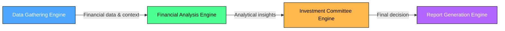
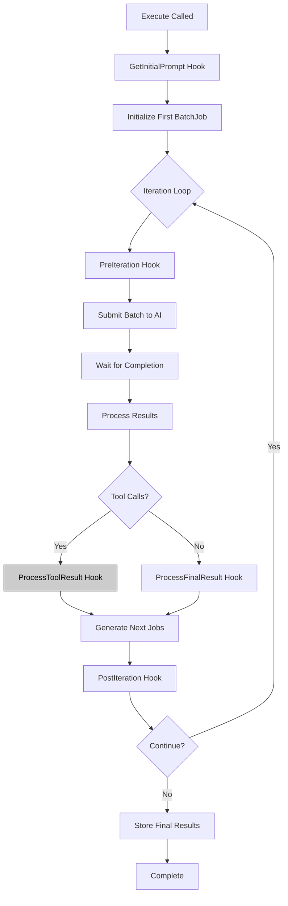
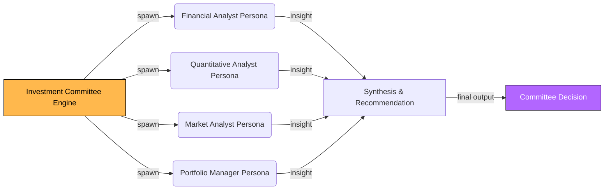
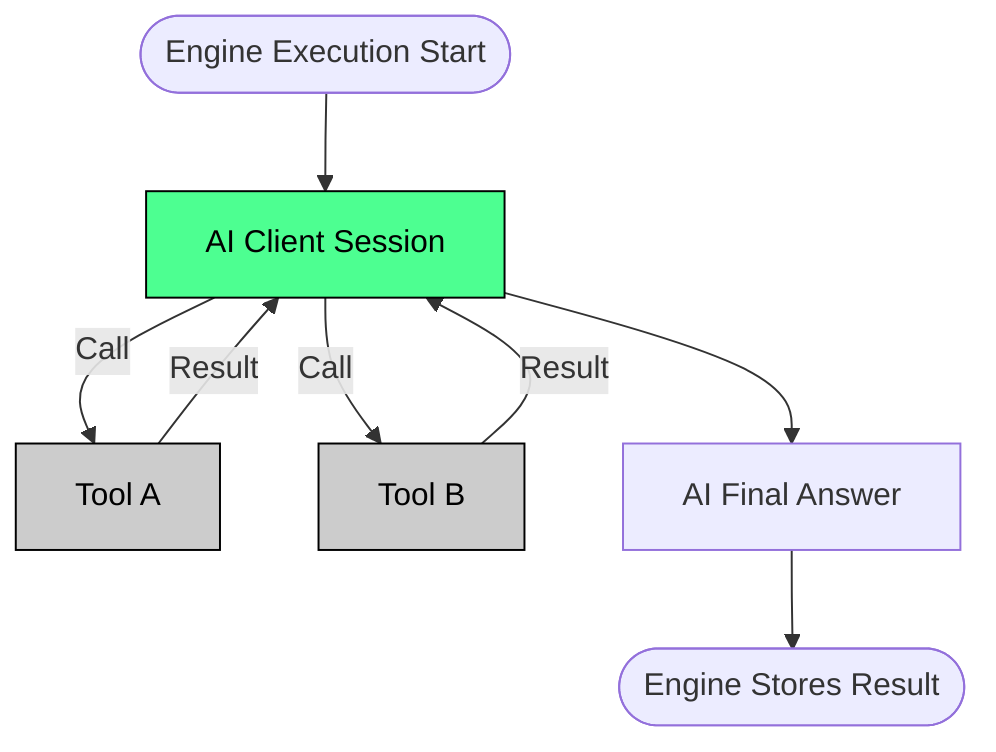
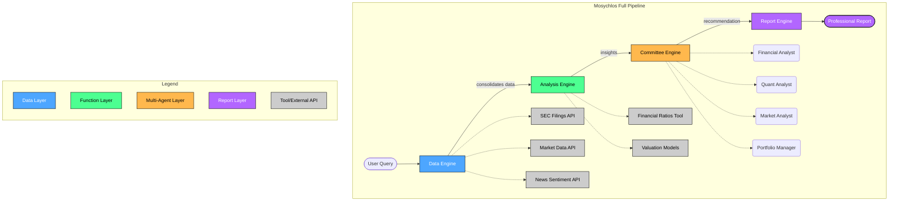

Here’s the full roadmap of **Mosychlos Engine & Tool Execution Flows** in **Markdown** with embedded Mermaid diagrams:

# Engine and Tool Execution Flows in Mosychlos

Mosychlos uses a **chained engine orchestration** approach for multi-layer analysis workflow.
Each engine corresponds to a phase (Data, Function, Multi-Agent, Report) and runs sequentially in a single AI session, sharing one context state (the `SharedBag`).

---

## Figure 1: Sequential Engine Chain



---

## Figure 2: Batch Engine Iterative Flow



---

## Figure 3: Parallel Multi-Persona Flow



---

## Figure 4: Tool Calling within an Engine



---

## Figure 5: Complete Engine & Tool Execution Flow (Mosychlos Pipeline)



---

```

```
